# Class 12 Science PCM / PCMB Prerequisite Hub

## Career Roadmap Overview

This diagram outlines a comprehensive career pathway system for Class 12 Science students (PCM/PCMB), organized into 5 major modules covering diverse career options from pure research to corporate paradigm shifts.

```mermaid
graph TD
    %% Custom Design Aesthetics
    classDef default fill:#0f172a,stroke:#38bdf8,stroke-width:2px,color:#fff;
    classDef root fill:#020617,stroke:#ef4444,stroke-width:4px,color:#fff,font-weight:bold;
    classDef branch fill:#1e293b,stroke:#3b82f6,stroke-width:3px,color:#fff,font-weight:bold;
    classDef assam fill:#7c2d12,stroke:#ea580c,stroke-width:2px,color:#fff;
    classDef india fill:#1e3a8a,stroke:#2563eb,stroke-width:2px,color:#fff;
    classDef global fill:#4c1d95,stroke:#7c3aed,stroke-width:2px,color:#fff;

    %% Central Node
    ROOT[CLASS 12 SCIENCE<br>PCM / PCMB Prerequisite Hub]:::root

    %% Five Structural Core Branches
    M1[MODULE 1: PURE RESEARCH<br>The Academic Matrix]:::branch
    M2[MODULE 2: ENGINEERING<br>Applied Physics & Deep-Tech]:::branch
    M3[MODULE 3: MEDICAL PHYSICS<br>Clinical Diagnostics & Radiotherapy]:::branch
    M4[MODULE 4: VOCATIONAL TECH<br>Transit & Material Testing Wings]:::branch
    M5[MODULE 5: PARADIGM SHIFTERS<br>Cross-Functional Corporate Hub]:::branch

    ROOT --> M1
    ROOT --> M2
    ROOT --> M3
    ROOT --> M4
    ROOT --> M5

    %% Module 1 Sub-Network
    M1 --> M1_deg[Degrees: B.Sc. Hons / BS / Integrated BS-MS]
    M1_deg --> M1_spec[Specialisms: Astrophysics, Quantum Computing, Materials Science, Nuclear Physics]
    M1_spec --> M1_A[Assam: Cotton, Gauhati, Dibrugarh, Tezpur Universities<br>Exam: CUET-UG / Merit]:::assam
    M1_spec --> M1_I[Pan-India: IISc, IISERs, NISER, TIFR, Delhi Univ, CMI<br>Exam: IAT, NEST, IIT-JAM, JEST]:::india
    M1_spec --> M1_G[Global: MIT, Caltech, Princeton, Cambridge, Oxford, ETH Zurich<br>Exam: SAT + AP Physics + IELTS]:::global

    %% Module 2 Sub-Network
    M2 --> M2_deg[Degrees: B.Tech / B.E. / M.Tech / Ph.D.]
    M2_deg --> M2_spec[Specialisms: Engineering Physics, Photonics, Semiconductors, Aerospace, Robotics]
    M2_spec --> M2_A[Assam: IIT Guwahati, NIT Silchar, IIITG, AEC, JEC<br>Exam: JEE Advanced, JEE Main, Assam CEE]:::assam
    M2_spec --> M2_I[Pan-India: IIT Bombay, IIT Delhi, IIT Madras, BITS Pilani, DTU<br>Exam: JEE Advanced, JEE Main, BITSAT]:::india
    M2_spec --> M2_G[Global: Stanford, UC Berkeley, Manchester, NUS, Delft University<br>Exam: SAT + STEM Portfolio]:::global

    %% Module 3 Sub-Network
    M3 --> M3_deg[Degrees: B.Sc. Medical Tech, M.Sc. Medical Physics, Post-Grad Safety Diploma]
    M3_deg --> M3_spec[Specialisms: Radiation Dosimetry, Medical Imaging, Radiotherapy, Nuclear Medicine]
    M3_spec --> M3_A[Assam: AIIMS Guwahati, GMCH, AMCH, SSUHS Campus Networks<br>Exam: NEET-UG, SSUHS CEE]:::assam
    M3_spec --> M3_I[Pan-India: AIIMS New Delhi, PGIMER, CMC Vellore, Tata Memorial, JIPMER<br>Exam: NEET-UG, AIIMS Institutional]:::india
    M3_spec --> M3_G[Global: Johns Hopkins, MD Anderson, King's College London, Univ of Sydney<br>Exam: SAT / MCAT / UCAT]:::global

    %% Module 4 Sub-Network
    M4 --> M4_deg[Degrees: Commercial Pilot License CPL, B.Sc. Aviation, B.Sc. Nautical Science, HND]
    M4_deg --> M4_spec[Specialisms: Aerodynamics, Ship Displacement Mechanics, GIS Remote Sensing, NDT Testing]
    M4_spec --> M4_A[Assam: Dibrugarh Univ, Cotton Univ, Assam Flying Club<br>Exam: Entrance Screening / Medical Fitness]:::assam
    M4_spec --> M4_I[Pan-India: IGRUA Rae Bareli, IMU Campuses, IIRS Dehradun<br>Exam: IMU-CET, IGRUA Test, CUET-UG]:::india
    M4_spec --> M4_G[Global: CAE Oxford Aviation Academy, Embry-Riddle, Singapore Maritime Academy<br>Exam: COMPASS Pilot Aptitude + Class 1 Medical]:::global

    %% Module 5 Sub-Network
    M5 --> M5_deg[Degrees: BS Financial Math, Integrated IPM, 5-Yr B.Sc. LL.B. Hons, Civil Services]
    M5_deg --> M5_spec[Specialisms: Quantitative Finance, Business Operations Strategy, Patent Law, UPSC/APSC]
    M5_spec --> M5_A[Assam: NLUJA Guwahati, IIM Shillong, Gauhati Univ Law Dept<br>Exam: CLAT, IPMAT, APSC Frameworks]:::assam
    M5_spec --> M5_I[Pan-India: ISI Kolkata/Bangalore, IIM Indore, NLSIU Bangalore, SRCC Delhi<br>Exam: IPMAT, JIPMAT, CLAT, ISI Test, CAT]:::india
    M5_spec --> M5_G[Global: Wharton UPenn, LSE London, INSEAD France/Singapore, Harvard Law<br>Exam: SAT / ACT / LNAT + Portfolios]:::global
```

---

## Module Breakdown

### 📚 MODULE 1: PURE RESEARCH - The Academic Matrix
Focus on theoretical and experimental physics research careers.
- **Degrees:** B.Sc. Honours, BS, Integrated BS-MS
- **Specialisms:** Astrophysics, Quantum Computing, Materials Science, Nuclear Physics
- **Regional Options:** Assam universities, Pan-India research institutes, Global top-tier universities

### ⚙️ MODULE 2: ENGINEERING - Applied Physics & Deep-Tech
Technical and applied engineering pathways.
- **Degrees:** B.Tech, B.E., M.Tech, Ph.D.
- **Specialisms:** Engineering Physics, Photonics, Semiconductors, Aerospace, Robotics
- **Regional Options:** IITs, NITs, BITS, and international engineering schools

### 🏥 MODULE 3: MEDICAL PHYSICS - Clinical Diagnostics & Radiotherapy
Healthcare and medical technology careers.
- **Degrees:** B.Sc. Medical Tech, M.Sc. Medical Physics, Post-Grad Safety Diploma
- **Specialisms:** Radiation Dosimetry, Medical Imaging, Radiotherapy, Nuclear Medicine
- **Regional Options:** AIIMS, medical colleges, and international medical institutions

### ✈️ MODULE 4: VOCATIONAL TECH - Transit & Material Testing Wings
Specialized vocational and technical careers.
- **Degrees:** Commercial Pilot License (CPL), B.Sc. Aviation, B.Sc. Nautical Science, HND
- **Specialisms:** Aerodynamics, Ship Mechanics, GIS Remote Sensing, NDT Testing
- **Regional Options:** Aviation academies, maritime institutes, and international flight schools

### 💼 MODULE 5: PARADIGM SHIFTERS - Cross-Functional Corporate Hub
Interdisciplinary and management-focused pathways.
- **Degrees:** BS Financial Math, Integrated IPM, B.Sc. LL.B. Hons, Civil Services
- **Specialisms:** Quantitative Finance, Business Strategy, Patent Law, UPSC/APSC
- **Regional Options:** Business schools, law universities, and global institutions

---

## How to Use This Roadmap

1. **Identify Your Interest:** Start with the central hub and choose a module that aligns with your career goals
2. **Explore Specialisms:** Review the specialization options within each module
3. **Check Regional Options:** Find institutions in Assam, Pan-India, or Global options
4. **Review Entrance Exams:** Each pathway lists relevant entrance exams and qualifications
5. **Plan Accordingly:** Use this as a guide for your 12th-grade subject selection and entrance preparation

---

**Last Updated:** June 2026
